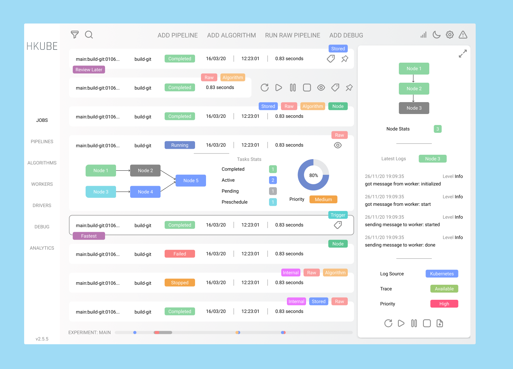

# Dashboard v2

Another iteration for [simulator - web-based UI for HKube](https://github.com/kube-HPC/simulator).

Main building blocks:

- [Atomic Design](https://bradfrost.com/blog/post/atomic-web-design/)
- [Tailwind CSS](https://tailwindcss.com/)
- [Redux toolkit](https://redux-toolkit.js.org/)
- [Gatsby](https://www.gatsbyjs.com/)
- [Motion (Animations)](https://www.framer.com/api/motion/animation/)
- [React - UI Library](https://reactjs.org/docs/getting-started.html)

---

- [Figma](https://www.figma.com/file/EcNSXgVU5MLRfdjLKh8Fdf/HKube-Dashboard?node-id=0%3A1) (Prototyping)
- [Repository](https://github.com/kube-HPC/dashboard)

[See related Roadmap](https://github.com/kube-HPC/hkube/issues/775).

